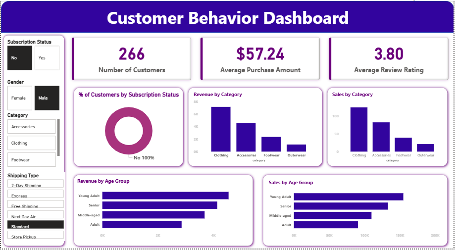

# Customer Behavior Analysis Dashboard

## 📌 Overview

The **Customer Behavior Analysis Dashboard** is a Power BI project designed to analyze customer purchasing behavior, sales performance, and revenue trends through interactive visualizations.

This dashboard helps businesses understand:
- Customer purchasing patterns
- Revenue generation by category
- Sales performance
- Customer segmentation
- Subscription insights
- Shipping preferences

The project provides actionable insights for improving customer engagement and business decision-making.

---

# 📷 Dashboard Preview



> Make sure the image file `Customer_behavior_dashboard.PNG` is uploaded in the same GitHub repository folder as the README file.

---

# 🚀 Features

- Interactive Power BI dashboard
- KPI cards for quick business insights
- Revenue analysis by product category
- Sales analysis by category
- Customer segmentation by age group
- Subscription status analysis
- Shipping type analysis
- Dynamic filters and slicers
- User-friendly dashboard design

---

# 📊 Key Metrics

| Metric | Value |
|---|---|
| Total Customers | 266 |
| Average Purchase Amount | $57.24 |
| Average Review Rating | 3.80 |

---

# 📈 Dashboard Insights

- Clothing category generated the highest revenue and sales.
- Young Adults contributed the highest customer purchases.
- Most customers are non-subscribers.
- Standard shipping method is highly preferred.
- Revenue and sales vary significantly across categories.

---

# 🛠️ Tools & Technologies Used

- Power BI
- DAX (Data Analysis Expressions)
- Data Visualization
- Data Cleaning
- Business Intelligence
- Excel / CSV Dataset

---

# 📂 Project Structure

```bash
Customer-Behavior-Analysis/
│
├── Customer_Behavior_Analysis.pbix
├── Customer_behavior_dashboard.PNG
├── README.md
└── requirements.txt
```

---

# 📋 Dashboard Components

## KPI Cards
- Number of Customers
- Average Purchase Amount
- Average Review Rating

## Visualizations Used
- Donut Chart
- Bar Charts
- Horizontal Bar Charts
- Interactive Slicers
- Category-wise Analysis

---

# 🎯 Filters Available

- Subscription Status
- Gender
- Product Category
- Shipping Type

---

# ⚙️ Installation & Usage

## Step 1: Clone the Repository

```bash
git clone https://github.com/PriyankaMittha/customer-behavior-analysis-powerbi.git
```

## Step 2: Open the Dashboard

- Install **Power BI Desktop**
- Open the `.pbix` file

```bash
Customer_Behavior_Analysis.pbix
```

## Step 3: Explore the Dashboard

Use filters and slicers to analyze:
- Customer behavior
- Revenue trends
- Sales performance
- Category insights

---

# 📚 Learning Outcomes

Through this project, I learned:

- Data visualization techniques
- Business intelligence reporting
- Power BI dashboard creation
- Data modeling
- DAX calculations
- Customer behavior analysis
- Interactive dashboard designing

---

# 🔮 Future Improvements

- Add real-time data integration
- Implement predictive analytics
- Create advanced DAX measures
- Add customer retention analysis
- Deploy dashboard to Power BI Service

---

# 👩‍💻 Author

## Priyanka Mittha

- LinkedIn: https://www.linkedin.com/in/priyanka-mittha
- GitHub: https://github.com/PriyankaMittha

---

# ⭐ If You Like This Project

Give this repository a ⭐ on GitHub and share your feedback!

---
